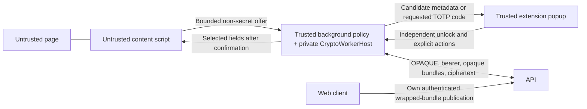

# ADR-0011: C04 approval packet and recommended synthesis

Status: **APPROVED by the human security reviewer — 2026-09-05.**

Date: 2026-09-05. Reviewed baseline: `95846a9`.
Task: [C04-ADR-DRAFT](../tasks/C04-ADR-DRAFT.md), preparing
[C04](../tasks/C04.md) for a human decision.

This proposal combines [ADR-0009](./ADR-0009-c04-extension-vault-bridge-proposal.md)
and [ADR-0010](./ADR-0010-c04-extension-vault-bridge-proposal-b.md).
ADR-0011 is the selected synthesis; ADR-0009 and ADR-0010 remain historical
alternatives and are not implementation authority. This approval authorizes the
bounded contract and implementation work explicitly described below. It does not
authorize unrelated crypto, recovery, WebAuthn, release, or contract rewrites.

## Decision requested

Recommend the hardened message boundary from proposal A and the background-local
crypto host from proposal B, with online-only extension operation initially.
Approve the architectural direction D1–D6 and the concrete candidate contract
decisions G1/G2 below. **Direction approval alone must not mark C04 READY:**
G1/G2 were approved with this ADR. The integrator must still create bounded
tasks, preserve prior contract snapshots, and verify the listed tests before
merging implementation. This distinction prevents implementation scope from
expanding beyond the reviewed bundle or device decisions.

| Decision | Recommended disposition | Consequence the reviewer accepts |
|---|---|---|
| D1: Authentication and discovery | Independent OPAQUE login; user enters accountId and explicitly confirms the HTTPS API origin. Add a copyable accountId view to the web app. | No web-to-extension token, storage, recovery-kit, or key handoff; manual setup until a separate linking design exists. |
| D2: Crypto hosting | Instantiate the existing `CryptoWorkerHost` and WASM adapter in the extension background realm, with private host/session ownership. | There is no additional dedicated Worker isolation inside the background. A compromised privileged background can access its live state; do not claim an OS-process boundary or equivalence to the web's Worker boundary. |
| D3: Fill/save authority | Popup-only user selection; exact-origin, document-bound, one-use fill; manual popup save/update. | Remove content-script `fill` and credential-bearing `save-submitted`; pages cannot choose an item or assert a trusted gesture. |
| D4: Persistence and availability | Persist account association only; no extension offline unlock, wrapped-bundle cache, item cache, or durable mutation queue in the first slice. | Network loss blocks secret display/fill/save; existing web offline behavior remains its own scope. Unsaved popup edits can be lost on lock/eviction and must be disclosed. |
| D5: Lifetime and revocation | Background restart/eviction, explicit lock/logout, popup close, expiry, authentication failure, and five minutes without trusted popup activity lock locally. Revalidate online before every secret release or mutation. | Popup close may require a fresh unlock on next use; there is no claim of instantaneous remote erasure. Untrusted content traffic never extends the unlock timeout. |
| D6: WASM and TOTP | Permit packaged WASM with the narrow `wasm-unsafe-eval` CSP source; extend ADR-0008's native Web Crypto TOTP permission to extension background display/fill only. | No general `unsafe-eval`, inline/remote code, new cryptographic primitive, offscreen document, or raw-key export. TOTP seeds stay in the trusted background. |

## Verified context and corrections to the candidates

Evidence below is from the baseline, not a claim that proposed behavior exists.

| Finding | Source | Correction / disposition |
|---|---|---|
| Key-bundle GET and PUT exist only in the API contract; neither is mounted or called by the web client. | `packages/contracts/openapi.yaml:23`; `apps/backend/src/app.mjs`; `packages/sdk/src/http-client.ts`; `apps/web/src/views/onboarding.tsx` | Proposal B's “exactly as apps/web does” description is incorrect. Both upload by the web client and download by the extension are prerequisites. |
| Storage already exists. | `db/migrations/001_initial.sql:28` | Reuse `key_bundles(account_id,bundle,version,updated_at)`. OpenCode's suggested new storage column/migration is not established as necessary. Never rewrite migration 001. |
| No wire serialization maps `KeyBundle.bundle` to `AccountBundle`. | `apps/web/src/vault/account-bundle.ts:12`; `packages/contracts/openapi.yaml:62` | G1 must define that mapping, version semantics, and safe publication/replacement before code. |
| Device publicKey is required and stored, but has no implemented proof-of-possession semantics. | `packages/contracts/openapi.yaml:64`; `apps/backend/src/devices/routes.mjs:38`; `apps/backend/src/devices/store.mjs:11`; `db/migrations/001_initial.sql:19` | G2 is a real contract decision. Do not disguise random/fixed marker bytes as a public key. |
| Popup/content authority is not separated at runtime. | `apps/extension/src/background.ts:54`; `apps/extension/src/protocol.ts` | One message listener currently accepts both unions without sender identity/URL/frame validation. TypeScript types or separate listeners cannot authenticate a sender. |
| Direct content-script fill accepts caller-supplied itemId/gesture; submit capture transports credentials even though save is refused. | `apps/extension/src/background.ts:79`; `apps/extension/src/content.ts`; `apps/extension/src/protocol.ts` | These paths must be removed before a real unlock producer is wired. The shipped placeholder has no unlock caller, so this review does not establish current live-vault exploitation. |
| AccountId comments describe a copyable UI, but the actual onboarding/unlock views do not provide that affordance. | `apps/web/src/crypto/account-id.ts`; `apps/web/src/views/onboarding.tsx`; `apps/web/src/views/unlock.tsx`; STATUS C01 limitation | Add explicit web discovery UI; a source comment is not an implemented flow. |
| Recovery-reset is not implemented. | `docs/decisions/ADR-0006-b04-opaque-server-binding-and-scope.md` | Proposal B's recovery-reset cascade is a future requirement, not an existing route or C04 acceptance result. |

Claude and OpenCode independently identified the device and bundle gaps.
The integrator verified their claims against the code; recommendations from an
agent are not approvals. In particular, the non-functional publicKey marker and
the no-device/no-refresh fallback are rejected as ways of closing C04: the
first assigns undocumented credential semantics; the second cannot satisfy
the distinct-device revocation acceptance criterion.

## Proposed runtime boundary

Background owns AuthClient/ApiClient, OPAQUE transient state, bearer token,
WASM adapter, host session handles, and bounded decrypted item state. UI cannot
request a raw-key export or arbitrary host operation. Existing Rust crypto
operations remain unchanged. A host exception fails closed and disposes the
session; restart creates new locked state. Closing a JavaScript realm does not
prove physical memory erasure: clear mutable buffers and references best-effort,
and rely on existing Rust zeroization for its owned buffers.

The configured API must be an explicitly confirmed HTTPS origin, pinned per
account association. Reject URL credentials, query/fragment configuration,
cross-origin redirects, and API destinations supplied by page/content messages.
Only the trusted client sends the bearer header. A bearer authenticates the
account/session, not an attestation that a particular browser binary sent it.
TLS validation remains required; C04 approval does not waive deployment TLS.

| Boundary | Permitted data | Authentication / limits |
|---|---|---|
| Page → content | DOM/form state only | No page-message bridge; never capture submitted credential values. |
| Content → background | Bounded offer metadata for the current top document, or cancellation | Validate runtime sender id, tab, frameId=0, browser-provided sender URL and HTTPS origin. Ignore caller gesture, candidate/item identifiers, tokens, and plaintext fields; reject unknown fields. |
| Popup → background | Account/API setup; password bytes at unlock; candidate choice; popup-entered save/update fields; explicit TOTP/lock/logout actions | Exact extension popup URL, runtime id, absence of content-tab sender, authenticated live popup port. No external messaging. Validate each request schema before handling. |
| Background → popup | Lock/error state; minimum candidate metadata for the bound offer; explicit current TOTP display | Only the same authenticated popup; no keys, bearer, wrapper bundle, seed, general decrypt result, or vault enumeration API exposed to content. |
| Background → content | One selected username/password, or separately approved current TOTP code | Consume one-use capability; target the exact top document/port; never broadcast a credential to a whole tab or all frames. |
| Background ↔ host | Existing bounded request types and crypto results needed by trusted orchestration | Private in-process calls, not runtime message forwarding; handles never exposed as external capabilities. |
| Background/web ↔ API | Account IDs, OPAQUE bytes, session headers, approved wrapped bundle, item ciphertext and protocol metadata | Account-scoped bearer authorization and normal sync concurrency; no password, plaintext fields, seed/code, raw key, or page URL in requests/logs. |

Chrome runtime messaging uses JSON serialization, unlike structured clone in
other browsers. Specify a bounded JSON-compatible integer-byte-array encoding
for password/edit buffers; reconstruct Uint8Array inside background and clear
both caller/receiver arrays after use. Do not assume transfer ownership or
zero-copy Uint8Array transport. Serialized browser-managed copies and immutable
strings cannot be reliably erased. For Chrome asynchronous message responses,
use the documented callback/`return true` compatibility path, rather than
assuming Promise listeners work on every supported build.
[Chrome messaging documentation](https://developer.chrome.com/docs/extensions/develop/concepts/messaging).

## Exact-origin authorization and cancellation

An accepted offer creates a background-generated unpredictable request ID with
a 30-second maximum lifetime, bound to account/session generation, popup port,
tab ID, top document identity, exact canonical HTTPS origin and form-action
origin. The popup requests candidates only for its currently active, bound tab.
The background determines candidate membership; caller-provided lists and
`userGesture: true` have no authority. The trusted popup click handler is the
source of the selection; a nonce binds that selection, it does not prove a
human gesture by itself.

Before releasing fields: validate the active popup/offer; perform a fresh
authenticated API check; recheck session generation after every await; re-read
the active tab/document and origin; revalidate candidate membership; consume
the capability once; send only to its recorded document. Content rechecks top
frame, HTTPS origin, visible/enabled/editable fields and same-origin form action
immediately before assignment. No HTTP, iframe, subdomain, look-alike fallback,
automatic fill, or reuse after navigation/form change is permitted.

Use browser-supplied document identity and targeted messaging where supported.
A verified document-bound port is an alternative only after cross-browser tests
prove navigation disconnect and no cross-document reuse. If neither can be
proved on a browser build, disable fill on that build; do not fall back to
tab-wide sends. Non-secret DOM facts from a compromised content script cannot
be made trustworthy by schema validation. The accepted threat boundary is that
it may receive the specifically approved fields at the user's exact-origin
fill point, never earlier or for another entry.
[Document targeting](https://developer.mozilla.org/en-US/docs/Mozilla/Add-ons/WebExtensions/Work_with_documentId).

Lock increments a session generation, invalidates all offers/ports, aborts
network work, disposes host sessions, clears bearer/cache/TOTP/form buffers,
and prevents late promises from restoring state or dispatching a fill. Logout
attempts server revocation but always clears local state in finally. A failed
logout cannot promise server revocation; the short-lived token expires normally.
Popup disconnect and background eviction are lock events. Before every request,
check the inactivity deadline and token expiry independently of timer callbacks.
Only trusted popup activity resets the five-minute deadline.

Every candidate/secret display, fill, TOTP generation and mutation requires a
successful fresh authenticated operation (for example GET /devices, already
implemented) under the current bound token. Network failure or 401 locks;
no offline cached-data fallback. While popup is open, check authorization at
most 30 seconds apart, with a 5-second network deadline; a delayed timer must
not authorize a later action without its own fresh check. A revoke racing an
already-authorized response cannot retract data already released; no claim of
instantaneous remote erasure is made. Tests must bound the *next action* and
active-popup detection, not rely on an idle service-worker polling timer.
Chrome can terminate an idle worker, so termination itself must be safe.
[Service-worker lifecycle](https://developer.chrome.com/docs/extensions/develop/concepts/service-workers/lifecycle).

Refresh, after G2's device binding is approved, is serialized in background,
rotates the one in-memory token atomically before expiry, and fails closed.
Never retry using the old token after rotation. Re-login creates a new explicit
device enrollment until a separately reviewed device-reuse proof exists.

## G1: Proposed bundle publication and serialization contract

Owner: contracts/backend and web/SDK task owners, human security reviewer.
Recommended direction: a versioned transport record containing C01's existing
wrapped bytes and public context, opaque to the server. It is not a new crypto
envelope, and base64/JSON must never be described as encryption.

The candidate specification for human approval is:

- `KeyBundle.bundle` is `b64:` plus padded standard base64 of UTF-8 JSON,
  without BOM, whitespace, or final newline. The object has exactly these keys
  in this order: `format`, `accountId`, `vaultId`, `itemId`,
  `kdfParametersCbor`, `wrappedAccountKey`, `wrappedVaultKey`, `wrappedItemKey`,
  `wrappedRecoveryKey`. All values are strings. `format` is exactly
  `c04-account-bundle/1`; IDs satisfy the existing API Id grammar. The five
  byte-string values use existing padded `b64:` encoding, with no transformation
  of the underlying C01 bytes. The synthetic wrapping itemId is retained and
  must not be confused with individual item-record IDs. JSON is transport
  framing around existing authenticated wrappers, never a substitute for CBOR
  inside those wrappers or for encryption.
- Serialize fields in that fixed order using ordinary JSON string encoding.
  Readers parse, validate the exact field set/types/alphabet, then reproduce
  the specified serialization and compare bytes with the received record.
  This rejects duplicates, reordered keys, escaped alternatives, unknown fields
  and noncanonical base64 instead of silently normalizing hostile input.
  Reject unknown format. Limit decoded JSON to 512 KiB, each decoded wrapper
  to 64 KiB, and decoded KDF parameter CBOR to 512 bytes; reject empty values.
  HTTP request/response bounds must allow base64 expansion but reject before
  unbounded buffering. No raw recovery key, raw encryption key, token or item
  plaintext is part of this record.
- Outer `KeyBundle.version` is the monotonic publication revision, not the
  record format or any wrapper's keyVersion. It is an integer 1..2147483647.
  Existing wrapper keyVersions remain encoded/authenticated by Rust; the first
  C04 client accepts C01's version-1 hierarchy only and fails closed on an
  unsupported hierarchy instead of feeding publication revision into unwrap.
- Verification of authenticated account/context against every existing wrapper
  and Rust AEAD checks, KDF resource caps before derivation, hard failure for
  mismatched/tampered contexts; no “repair” that generates replacement keys.
- Use an authenticated, explicit web publication flow for existing local accounts,
  and publication after successful registration/login/recovery-kit confirmation
  for new accounts. The extension only obtains the remote record after its own
  login. Never make the extension read/copy the web app's local bundle directly.
- GET/PUT derive account ownership exclusively from the authenticated session
  and use the existing key_bundles row for that account. GET returns 200 with
  exact stored bytes/revision; an authenticated account without a bundle gets
  404 ApiError. On an absent row, only version 1 may create; concurrent first
  publications are serialized by the existing PRIMARY KEY(account_id), using a
  single insert that detects a unique-key conflict rather than a lock on a row
  that does not exist. The losing writer re-reads and applies the rules below.
  On an existing row, lock that row in the transaction: identical bytes at the
  same revision are an idempotent 204; replacement requires version=current+1
  and commits atomically. An absent row with attemptedVersion other than 1,
  any other present-row revision, or different bytes at the same revision
  returns 409. Never implement read-then-write without this transaction/unique-
  constraint behavior. A lost acknowledgement is retried with identical bytes
  and version. If a later writer has advanced the revision, an older retry
  conflicts rather than rewinds.
- Proposed additive API amendment: introduce `KeyBundleConflict` with exactly
  `{error:"key_bundle_conflict", currentVersion: integer|null,
  attemptedVersion: integer}` (integer bounds as above). Reference it for
  key-bundle PUT 409 instead of fabricating ItemRecords. Keep item-mutation
  `Conflict` unchanged. Explicitly document GET 404 and GET/PUT 400/401/413
  with the existing secret-free ApiError shape. These are proposed corrections
  to a currently unimplemented frozen endpoint, **not** a claim of zero contract
  change. Existing contract snapshots must remain available and affected clients
  receive a reviewed contract revision; no version is silently overwritten.
- Initial publication validates the local password wrapper and available
  hierarchy via existing Rust calls, retains the local bundle on every failure,
  and confirms the same bytes/revision by authenticated GET before showing
  “ready for extension.” On conflict, stop and ask the user to resolve using
  the web client's authenticated local context; never overwrite a different
  remote bundle automatically. Existing accounts without a usable local bundle
  cannot be bootstrapped by inventing new keys. The extension reads but does not
  PUT key bundles in C04. Replacement/rotation UI remains out of scope; any
  future writer must retain the previous local wrapper until the normative
  copy-on-write and successful second-unlock requirements are met.
- An honest server enforces compare-and-swap revisions; a malicious server can
  replay a previously valid bundle to a fresh extension profile. This online-only
  first slice has no trusted persistent high-water mark and cannot guarantee
  first-enrollment freshness or detect a complete historic snapshot replay.
  AEAD context/integrity checks still apply. **Explicit reviewer acceptance is
  required for this residual T02/T10 limitation**; otherwise a separate trusted
  checkpoint/anti-rollback design blocks C04. A server version is not proof of
  freshness. Within a live session, reject revision regression and preserve the
  existing sync engine's monotonicity checks.
- After approval, add language-neutral positive/negative ciphertext/public-
  metadata fixtures and web→server→extension interop tests. Preserve existing
  envelope fixtures. Cases include canonical reserialization, duplicate/unknown
  keys, b64 variants, ID mismatch, oversized wrappers/KDF, two writers, lost
  acknowledgement, missing bundle, malformed server errors and account isolation.

G1 is APPROVED, including its API correction and first-enrollment replay residual.
Transcribing this text into normative contract files and generating fixtures is a
bounded post-approval task; implementation may not substitute another
serialization or relax the stated limits.

## G2: Honest device enrollment decision required

Owner: auth/contracts task owners, human security reviewer.
Current ADR-0005 behavior binds a freshly OPAQUE-authenticated session at device
registration, permits refresh only when bound, and cascades revocation correctly.
Neither API nor client exposes an approved persistent device-key scheme.

Proposed additive contract revision: represent
**bearer-authenticated, revocable enrollment without proof-of-possession** as
such. Preserve the existing DeviceCreate branch (`name`, `publicKey`, no unknown
fields) and add a disjoint branch with exactly `name` and
`enrollmentMode:"bearer-session-v1"`, with `publicKey` forbidden. Apply the
existing name bounds. Missing/unknown mode or mixtures of both branches return
400 ApiError. The new branch may be used only by a valid, device-unbound,
freshly OPAQUE-issued session; an already bound session cannot rebind itself.
Existing publicKey-bearing clients retain their prior behavior. No proof of
possession is claimed for either branch by the current implementation.

In a forward-only migration, add a constrained enrollment_mode column with
existing rows classified as `legacy-public-key`, permit public_key NULL only
for `bearer-session-v1`, and require non-null public_key for the legacy mode.
Store the new mode and bind the authenticated session to a server-generated
deviceId in one transaction under a session-row lock, rechecking expiry/revoke
inside the transaction. A racing second enrollment must fail instead of moving
the binding. Keep Device response fields unchanged; do not return key/token
material. A lost enrollment acknowledgement locks the client; another independent
login may enroll again rather than inventing an unreviewed device-reuse protocol.
The existing server-side cascade and refresh eligibility remain unchanged.

G2 is APPROVED, including its explicit schema union, bearer-only semantics and
forward migration. It requires a retained contract revision. Negative cases include
anonymous/expired/revoked/bound-session enrollment, mixed payloads, concurrent
requests, account isolation, failed binding rollback, refresh token replay and
second-client revocation of the created extension device. Do not rewrite old
migrations or retrofit marker bytes into existing publicKey records.

Each extension login gets a distinct named device/session binding; the user can
revoke that device from the existing device list. Fresh master-password login
can enroll again; revocation is not a permanent ban on someone who knows the
master password. Do not share the web deviceId or use an accountId as a credential.
If the reviewer requires real device-key proof-of-possession instead, commission
a separate Rust-core-owned design with its own ADR/grant and tests; C04 cannot
invent it outside Rust. No placeholder `publicKey` and no unbound-session
fallback may be used to claim G2 is closed.

## Browser capability and validation gate

Target the repository's Chrome MV3 background service worker and Firefox MV2
nonpersistent background page. Use the same private in-process host policy in
both; no nested Worker/offscreen assumption is required. Validate actual supported
browser versions in E2E and record exact builds before merge; this document does
not pretend those tests or minimum versions have already been established.

Packaged JS/WASM only; CSP proposal is `script-src 'self' 'wasm-unsafe-eval';
object-src 'self'`. Chrome's default policy disables WASM. Firefox MV2 has a
legacy allowance but its documentation recommends explicitly declaring the
WASM source; do not misreport that as universal Firefox failure today.
[Chrome CSP](https://developer.chrome.com/docs/extensions/reference/manifest/content-security-policy),
[Firefox CSP](https://developer.mozilla.org/en-US/docs/Mozilla/Add-ons/WebExtensions/manifest.json/content_security_policy).

| Acceptance criterion / threat | Required evidence before C04 merge |
|---|---|
| Independent extension session; T04/T09 | Real WASM+API login and bundle interop from a fresh extension profile; no web-storage reads/token transfer; wrong password/account/origin fail generically. |
| Page/content cannot enumerate or bypass confirmation; T05/T06 | Runtime sender spoofing, content `get-offer`/`unlock`/`fill-selected`/direct-fill rejection, nonce replay, tab switch, same-origin navigation, iframe, DOM/form mutation, subdomains/look-alikes, and no tab-wide credential delivery. |
| Lock/restart/logout/revoke; T07/T09/T19 | Lock during every await, eviction/restart, empty vault correctly unlocked, popup close, timeout, refresh replay/concurrency, revoke from second client, stalled/offline network, late response and clock/timer delay. No action succeeds using stale session generation. |
| Opaque server data; T01/T02/T11 | Account authorization matrix, remote bundle substitution/version/oversize/KDF abuse, ciphertext-only save/update, dump/network/log checks without recording real secrets. |
| TOTP/save; T15 | Explicit popup input only; no page submit capture; seed never leaves background; separate display/fill actions and expired-code handling; native Web Crypto known-answer tests generated without storing real user secrets. |
| Build/runtime; T12 | Both real browser engines load packaged WASM under final CSP, callback messaging/byte arrays round-trip, host cleanup and document targeting pass; no remote code/offscreen/new unreviewed permission. |

Proposed post-approval work packages, **not dispatched implementation tasks**:

1. Human approval of D1–D6 and exact G1/G2 candidates, including the freshness
   residual, followed by normative contract transcription and public/ciphertext
   fixtures under explicitly recorded Allowed paths. Preserve prior contract
   snapshots; before approval no frozen-file edits are authorized.
2. Bundle/device backend + SDK + explicit web publication and copyable accountId UI, after those
   approvals. Proposed grants: `apps/backend/src/account/`, auth/device code only
   as named by G2, route registration in `apps/backend/src/app.mjs`, corresponding
   tests, `packages/sdk/`, `apps/web/`, and only reviewed forward migrations and
   generated contract artifacts. No blanket backend/crypto grant.
3. Extension host, schema/authority hardening, popup save/TOTP and lifecycle in
   `apps/extension/` and `packages/extension-adapters/`, followed by Chrome/Firefox
   E2E in task-owned paths. Existing `packages/crypto-worker/` and WASM exports
   are reused; widening them requires a separate scoped grant.

The integrator must create bounded task files and update Allowed paths after
approval, review each worker's diff and checks, and merge only passing reviewed
work. R01 routing/CORS deployment wiring for a new account route is a separate
explicit infra task. H02/public release gates remain in force.

## Human decision record

| Field | Value |
|---|---|
| Reviewer / date | Human security reviewer / 2026-09-05 |
| Decision | Approved D1–D6 and exact G1/G2 candidates |
| In-process isolation and online-only tradeoffs accepted | Approved |
| G1 exact contract and first-enrollment replay residual | Approved; residual accepted for C04's initial online-only slice |
| G2 exact contract and bearer-only device semantics | Approved |
| Implementation scope / browser evidence gate accepted | Approved; all listed evidence remains mandatory before C04 merge |

Recorded decision: “Approve ADR-0011 D1–D6 and the exact G1/G2 candidate
specifications, including G1's first-enrollment replay residual and G2's
bearer-only device semantics. Permit their normative contract revision and
bounded implementation after the integrator records task grants; require the
listed integration/browser evidence before merge.”

## Preparation completion report

Task: C04-ADR-DRAFT — approval preparation, synthesis candidate ADR-0011.
Status: APPROVED; C04 implementation may be dispatched in bounded packages.
Commits: see the task branch's `C04-ADR-DRAFT:` commit.
Changed paths: this new Markdown file only.
Contract changes: approved additive revisions for KeyBundle serialization/
conflict handling and bearer-only DeviceCreate enrollment; transcription and
fixtures remain a bounded implementation task.
Verification commands and results: `bun test apps/extension/test
packages/extension-adapters/test` — 9 pass, 0 fail, 26 assertions;
`bun run check:boundaries` — pass, on the integration checkout before editing.
These baseline checks do not prove C04's proposed behavior. Documentation
whitespace and relative-link checks passed on this document; independent final
review and any resulting corrections are recorded with the task's review evidence.
Known limitations: no new browser E2E or external audit; browser version matrix
and browser version matrix remain open; baseline worktree had
pre-existing uncommitted web/dev/WASM files, left untouched.
Security considerations: independent Claude/OpenCode review plus integrator
source verification; no secrets or implementation changes in this deliverable.
Follow-up tasks: approved G1/G2 contract transcription, backend/SDK/web bundle
publication, extension implementation, real-browser security verification, then
integration review.
